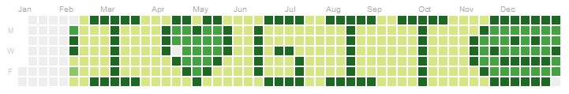

# STAT545 Homework 1 Repository
## Eric Sanders

Welcome! This is a repository used to store the contents of Homework Assignment 1 of *STAT545*, a course taught in the fall of 2018 at the University of British Columbia.

This repository is only contributed to by Eric Sanders, me! To see the main contribution to this repository besides this ReadMe, a quick exploration of the `ChickWeight` data frame in R, please **[click here](https://github.com/STAT545-UBC-students/hw01-ericjsanders/blob/master/hw01Exploration.md)**!

### Useful Links for Those Interested in *STAT545*

Here I present some helpful links to help navigate this course!

* [This link](http://stat545.com/Classroom/) will bring you to the main page of this course. It has many useful pages accessible from it, including:
    * [This page](http://stat545.com/Classroom/assignments/hw01/hw01.html) is the page describing the assignment that this repository is devoted to.
    * [Here you can see](http://stat545.com/Classroom/participation.html) how students in the course are marked for their participation.
* [Here is](https://github.com/STAT545-UBC/Discussion-Internal) a useful Github repository used by all class students to discuss course topics with each other.
* [This repository](https://github.com/ericjsanders/stat545_participation) is also my own, and holds files created while participating in lectures for *STAT545*.

**Wild**! To repeat the words of a reputable character, one might even say

> "GitHub is cool."
>
> *(Quote by ~~Eric Sanders~~ Everyone)*

