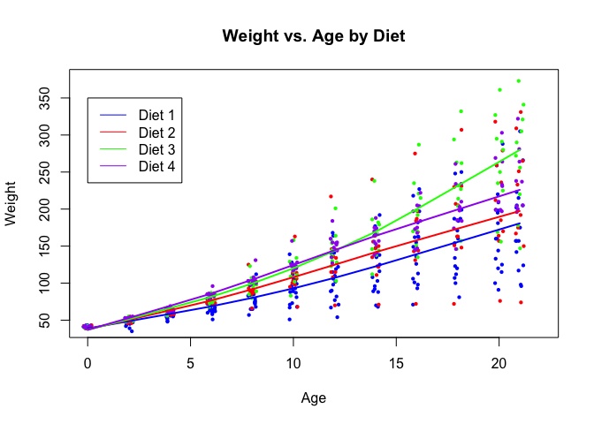

Stat545 Homework 1
================
Eric Sanders
Submitted for 2018-09-18


In this document we present some data exploration completed using the `ChickWeight` dataset.

Loading in and Examining Data Numerically
=========================================

First, we load the data

``` r
data(ChickWeight)
```

We will look at three variables in this data set. Namely, we will look at

-   `Diet`, which is categorical and marks four different chick diets.
-   `Weight`, which is continuous and indicates how large the chicks are growing.
-   `Age`, which is numerical and marks the 12 different ages at which chicks have measured.

Let us see how this data set looks.

``` r
ChickWeight = ChickWeight[,c('Diet','Time','weight')]
str(ChickWeight)
```

    ## Classes 'nfnGroupedData', 'nfGroupedData', 'groupedData' and 'data.frame':   578 obs. of  3 variables:
    ##  $ Diet  : Factor w/ 4 levels "1","2","3","4": 1 1 1 1 1 1 1 1 1 1 ...
    ##  $ Time  : num  0 2 4 6 8 10 12 14 16 18 ...
    ##  $ weight: num  42 51 59 64 76 93 106 125 149 171 ...

``` r
head(ChickWeight)
```

    ##   Diet Time weight
    ## 1    1    0     42
    ## 2    1    2     51
    ## 3    1    4     59
    ## 4    1    6     64
    ## 5    1    8     76
    ## 6    1   10     93

``` r
nrow(ChickWeight)
```

    ## [1] 578

So we can see that there are 578 observations of these three variables.

Exploring the Data with Plots
=============================

Now, let us look at how weight tends to vary with age. We can even include some jitter to get a better idea of how the points are dispersed.

``` r
plot(data=ChickWeight,weight~jitter(Time,1),pch=16,cex=0.6,xlim=c(0,22),ylim=c(40,375),xlab="Age",ylab="Weight",main="Weight vs. Age")
```


Unfortunately, this doesn't help very much if we are interested in comparing the diets of the chicks. Let us try to make four plots for the four diets with the same axes in order to compare.

We can also add to each plot a lowess fitted line. This is not for the sake of any inference or prediction, but just to consolidate our visualization into some loosely fitted lines.

``` r
par(mfrow=c(2,2))

plot(data=ChickWeight[which(ChickWeight$Diet==1),],weight~jitter(Time,1),col='blue',pch=16,cex=0.6,xlim=c(0,22),ylim=c(40,375),xlab="Age",ylab="Weight",main="Diet 1, Weight vs. Age")
lines(lowess(ChickWeight[which(ChickWeight$Diet==1),]$Time,ChickWeight[which(ChickWeight$Diet==1),]$weight))
plot(data=ChickWeight[which(ChickWeight$Diet==2),],weight~jitter(Time,1),pch=16,cex=0.6,col="red",xlim=c(0,22),ylim=c(40,375),xlab="Age",ylab="Weight",main="Diet 2, Weight vs. Age")
lines(lowess(ChickWeight[which(ChickWeight$Diet==2),]$Time,ChickWeight[which(ChickWeight$Diet==2),]$weight))
plot(data=ChickWeight[which(ChickWeight$Diet==3),],weight~jitter(Time,1),pch=16,cex=0.6,col="green",xlim=c(0,22),ylim=c(40,375),xlab="Age",ylab="Weight",main="Diet 3, Weight vs. Age")
lines(lowess(ChickWeight[which(ChickWeight$Diet==3),]$Time,ChickWeight[which(ChickWeight$Diet==3),]$weight))
plot(data=ChickWeight[which(ChickWeight$Diet==4),],weight~jitter(Time,1),pch=16,cex=0.6,col="purple",xlim=c(0,22),ylim=c(40,375),xlab="Age",ylab="Weight",main="Diet 4, Weight vs. Age")
lines(lowess(ChickWeight[which(ChickWeight$Diet==4),]$Time,ChickWeight[which(ChickWeight$Diet==4),]$weight))
```


As an alternative method of comparing diets, we can add these four fitted lines to the original plot, as follows.

``` r
plot(data=ChickWeight[which(ChickWeight$Diet==1),],weight~jitter(Time,1),col='blue',pch=16,cex=0.6,xlim=c(0,22),ylim=c(40,375),xlab="Age",ylab="Weight",main="Weight vs. Age by Diet")
points(ChickWeight[which(ChickWeight$Diet==2),]$weight~jitter(ChickWeight[which(ChickWeight$Diet==2),]$Time),pch=16,cex=0.6,col="red")
points(ChickWeight[which(ChickWeight$Diet==3),]$weight~jitter(ChickWeight[which(ChickWeight$Diet==3),]$Time),pch=16,cex=0.6,col="green")
points(ChickWeight[which(ChickWeight$Diet==4),]$weight~jitter(ChickWeight[which(ChickWeight$Diet==4),]$Time),pch=16,cex=0.6,col="purple")
lines(lowess(ChickWeight[which(ChickWeight$Diet==1),]$Time,ChickWeight[which(ChickWeight$Diet==1),]$weight),col='blue',lwd=2)
lines(lowess(ChickWeight[which(ChickWeight$Diet==2),]$Time,ChickWeight[which(ChickWeight$Diet==2),]$weight),col='red',lwd=2)
lines(lowess(ChickWeight[which(ChickWeight$Diet==3),]$Time,ChickWeight[which(ChickWeight$Diet==3),]$weight),col='green',lwd=2)
lines(lowess(ChickWeight[which(ChickWeight$Diet==4),]$Time,ChickWeight[which(ChickWeight$Diet==4),]$weight),col='purple',lwd=2)
legend(x=0,y=350,col=c('blue','red','green','purple'),lty=c(1,1,1,1),c("Diet 1","Diet 2","Diet 3",'Diet 4'))
```



After exploring the data, we may wish to further investigate if there is anything tangible to the observation that Diet 3 seems to have a higher contribution to weight in older chicks.
